<!-- footer: "Giovanni Norbedo" -->

<!-- _class: title-slide -->

# Caos in una catena alimentare a tre specie

## Analisi e Stabilizzazione del Modello di Hastings-Powell

    

**Giovanni Norbedo** (SM3201486)
Sistemi Complessi 2025/2026
Intelligenza Artificiale & Data Analytics

---

## Contesto e condizioni per il caos

Sistemi 2D (es. Lotka-Volterra):
- **Nessun caos**
- **Punto fisso** o **ciclo limite**

Sistemi $\ge$ 3D:
- **Caos possibile**
- Orbite confinate, intrecciate e aperiodiche

---

## Il modello a tre livelli

Catena trofica Hastings-Powell:

 

**Preda $X$**: crescita logistica

**Predatore $Y$**: consuma $X$

**Superpredatore $Z$**: consuma $Y$

---

## Sistema originale

Variabili biologiche non scalate:

 

$$
\begin{aligned}
\frac{dX}{dT} &= R_0 X \left(1 - \frac{X}{K_0}\right) - C_1 F_1(X) Y \\
\frac{dY}{dT} &= F_1(X) Y - F_2(Y) Z - D_1 Y \\
\frac{dZ}{dT} &= C_2 F_2(Y) Z - D_2 Z
\end{aligned}
$$

 

Con $F_i(U) = \dfrac{A_i U}{B_i + U}$

---

## Parametri biologici

| Parametro  | Significato                         |
| :--------- | :---------------------------------- |
| $R_0$      | Tasso di crescita intrinseco di $X$ |
| $K_0$      | Carrying capacity di $X$            |
| $C_1^{-1}$ | Tasso di conversione di $X$ a $Y$   |
| $C_2$      | Tasso di conversione di $Y$ a $Z$   |
| $D_1$      | Tasso di mortalità di $Y$           |
| $D_2$      | Tasso di mortalità di $Z$           |

$A_1, A_2, B_1, B_2$ parametrizzano le risposte funzionali saturanti di tipo II.

---

## Adimensionalizzazione

Riduzione parametri (da 10 a 6):

 

$$
\begin{aligned}
\dot{x} &= x(1-x) - f_1(x)y \\
\dot{y} &= f_1(x)y - f_2(y)z - d_1 y \\
\dot{z} &= f_2(y)z - d_2 z
\end{aligned}
$$

 

$f_i(u) = \frac{a_i u}{1 + b_i u}$

Con $z = 0$ abbiamo il modello Rosenzweig-MacArthur

---

## Risposta funzionale di Holling Tipo II

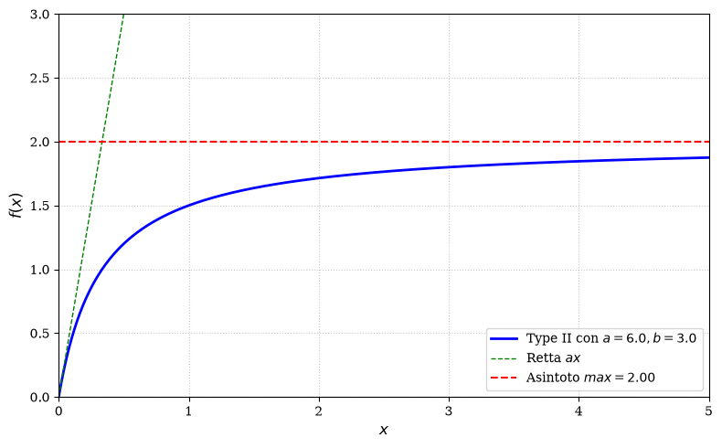

---

## Analisi dei punti di equilibrio

$E_0 = (0, 0, 0)$: Sempre instabile (punto di sella) dato che $\lambda_1 = 1 > 0$.

$E_1 = (1, 0, 0)$: Sopravvive la preda (carrying capacity). Instabile se $d_1 < f_1(1)$, altrimenti stabile.

$E_2 = (x^*, y^*, 0)$: Coesistenza preda-predatore con estinzione del superpredatore. Instabile se $d_2 < f_2(y^*)$, altrimenti stabile.

$E_3 = (x^*, y^*, z^*)$: Coesistenza globale. Nel regime caotico questo punto è instabile e dà origine all'attrattore strano.

---

## Parametri e dinamiche

 

| Parametro | Valore  |
| :-------- | :------ |
| $a_1$     | 5.0     |
| **$b_1$** | **3.0** |
| $a_2$     | 0.1     |
| $b_2$     | 2.0     |
| $d_1$     | 0.4     |
| $d_2$     | 0.01    |

$b_1$ Parametro guida variabile

$d_1 \gg d_2 \Rightarrow$ Sistema $X-Y$ rapido, $Z$ lento

---

## Equilibri nel Regime Caotico ($H=0$)

Valori analitici calcolati sul nostro set di parametri:

$E_0 = (0, 0, 0)$  
$\lambda = \{1,\ -0.4,\ -0.01\}$

$E_1 = (1, 0, 0)$  
$\lambda = \{-1,\ 0.85,\ -0.01\}$
*(Punto di sella)*

$E_2 = (0.105,\ 0.235,\ 0)$
$\lambda = \{0.006,\ 0.055 \pm 0.519i\}$
*(Fuoco repulsivo)*

$E_3 = (0.819,\ 0.125,\ 9.808)$
$\lambda = \{-0.611,\ 0.039 \pm 0.075i\}$

**Sella-Fuoco Instabile**

Un autovalore reale negativo (attrazione) e due complessi coniugati con parte reale positiva (repulsione a spirale).

---

## Dinamiche caotiche

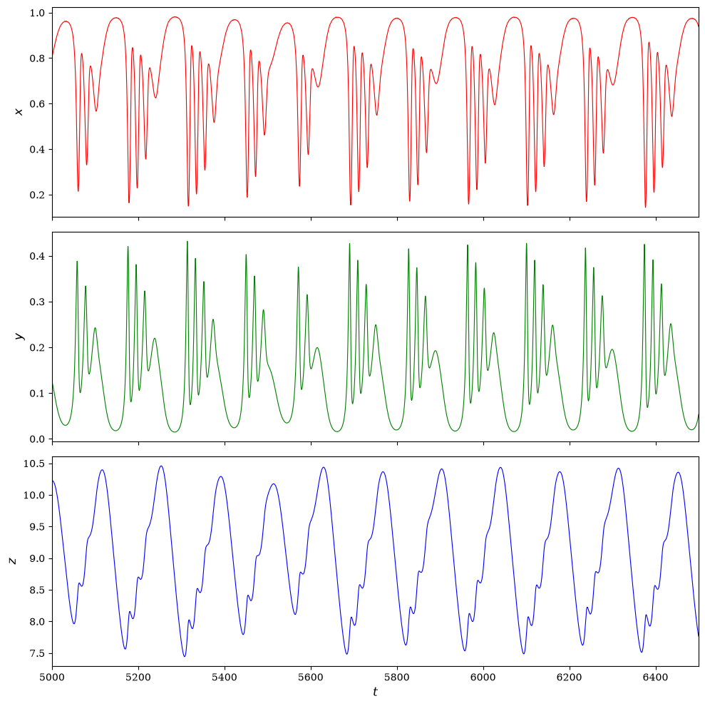

Oscillazioni rapide $X$ e $Y$  
Esplosione di $Z$ $\Rightarrow$ crollo di $Y$  
$Z$ crolla $\Rightarrow$ ripresa prede  

---

## Attrattore nello spazio delle fasi

**Teacup Attractor**

Caos confinato in 3D  

Orbite aperiodiche infinite  

Struttura "a tazza rovesciata"  

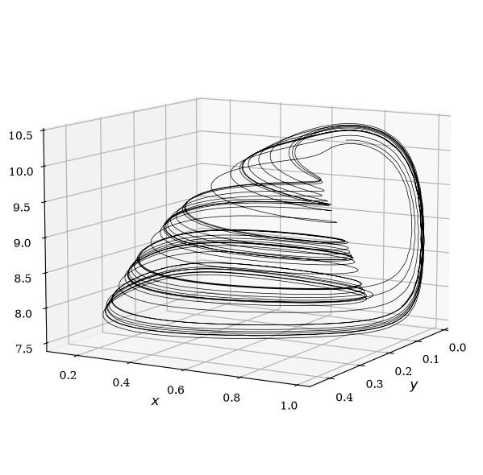

---

## Sensibilità alle condizioni iniziali

**Effetto Farfalla**

Micro-perturbazione  
$\Delta = 10^{-4}$  

Divergenza drastica  

Previsione a lungo termine impossibile  

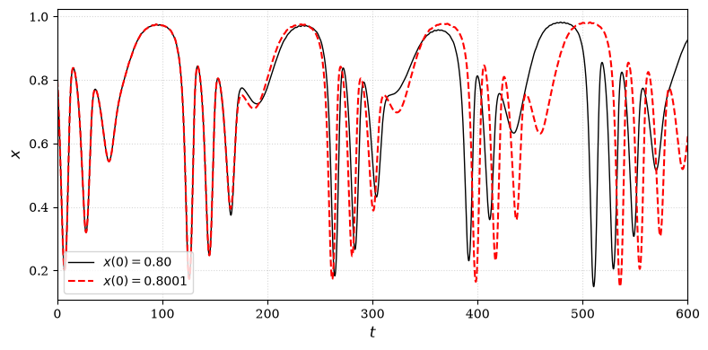

---

## Esponente di Lyapunov

**Prova matematica del caos**

Distanza logaritmica $\ln(d(t))$  

$d(t) = \| \text{sol}_1(t) - \text{sol}_2(t) \|$

Differenze iniziali $\varepsilon = 10^{-8}$

Divergenza esponenziale  

$\lambda_{max} > 0$  
(sistema caotico)  

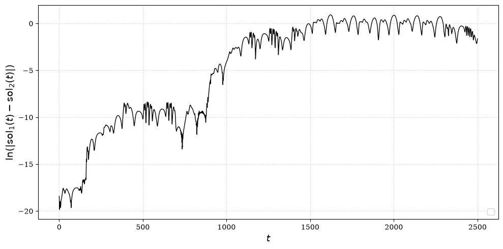

---

## Diagramma di biforcazione

Raddoppi di periodo $\rightarrow$ Caos

**Isteresi**: Bistabilità e salti asimmetrici

 

  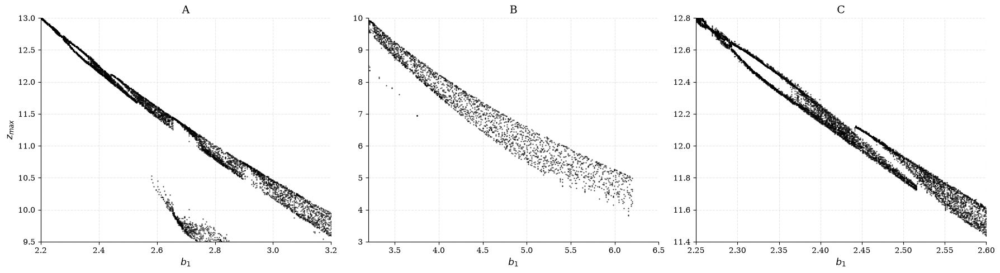

---

## Estensione al modello

**Harvesting** sul superpredatore:

 

$$\dot{z} = f_2(y)z - d_2 z - H z$$

 

$H$: Sforzo di caccia/pesca/prelievo  
Obiettivo: Forzare la stabilità  

---

## Diagramma di biforcazione al variare di H

$H < 0.003$: Caos

$H = 0.003$: Ciclo Limite

$H = 0.004$: Punto Fisso $E^*$

$H \ge 0.005$: Estinzione di $Z$

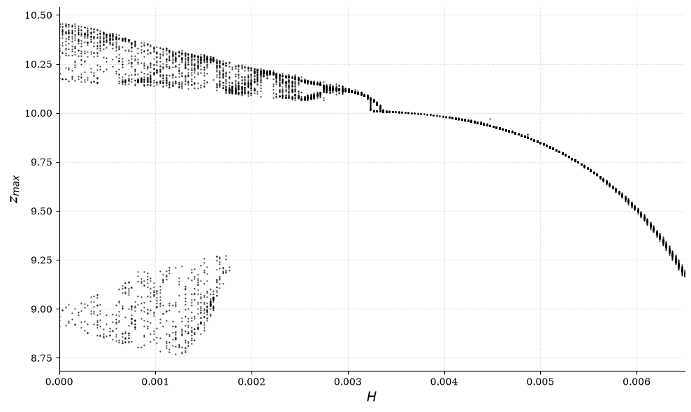

---

## Risultati della stabilizzazione

  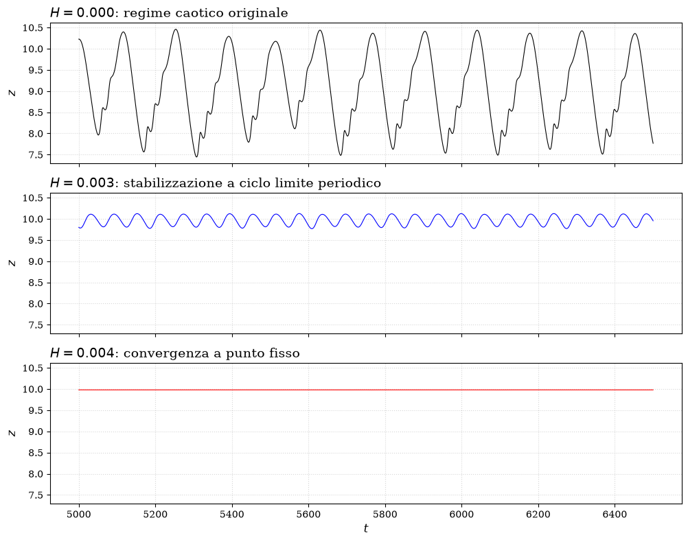

---

## Risultati della stabilizzazione 3D

  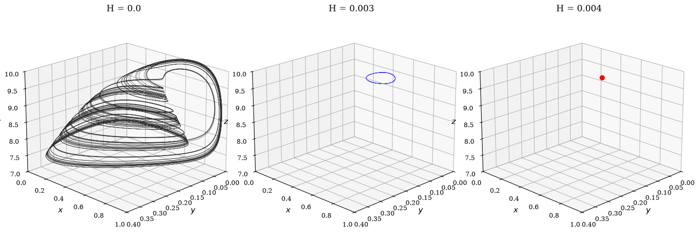

---

## Analisi Jacobiana di E*

Equilibrio per $H=0.004$: $E^* \approx (0.68, 0.19, 9.98)$

Autovalori di $J(E^*)$:

 

- $\lambda_1 = -0.193$
- $\lambda_2 = -0.035 + 0.127i$
- $\lambda_3 = -0.035 - 0.127i$

 

**$\text{Re}(\lambda_i) < 0$** $\Rightarrow$ LAS

---

## Evoluzione temporale verso l'equilibrio

  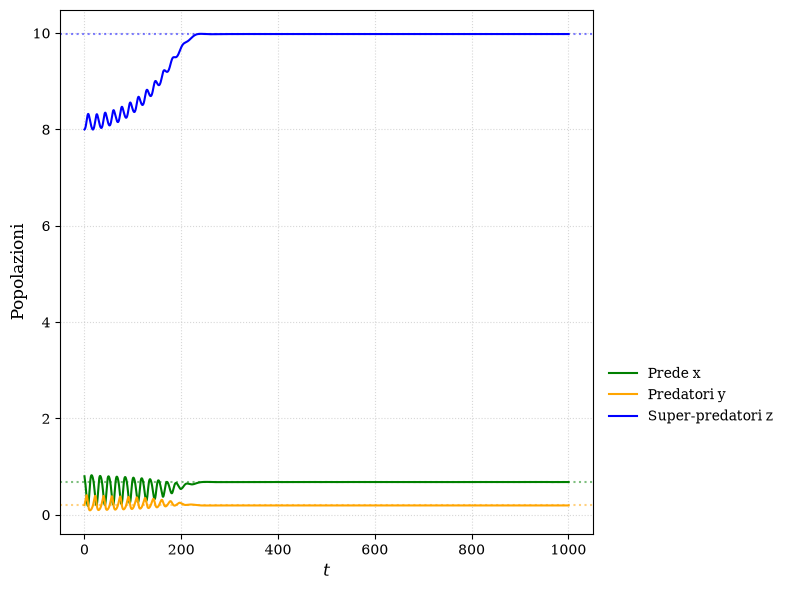

---

## Spazio delle fasi verso l'equilibrio

  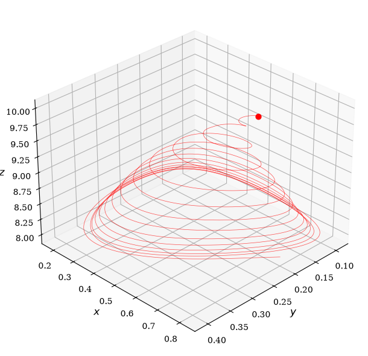

---

## Conclusioni

Un prelievo calibrato ($H=0.004$) stabilizza il caos.  

Un lievissimo eccesso ($H \ge 0.005$) estingue il superpredatore.  

L'intervento umano esige tolleranze perfette.
